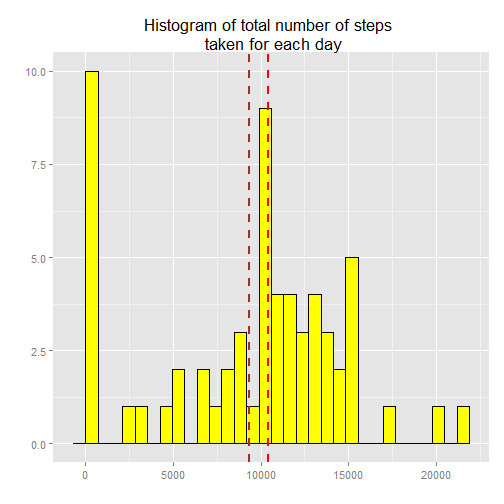
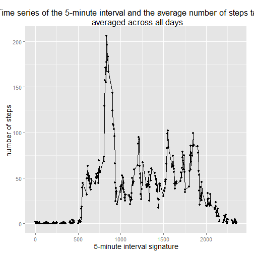
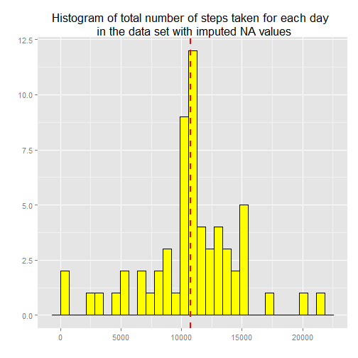
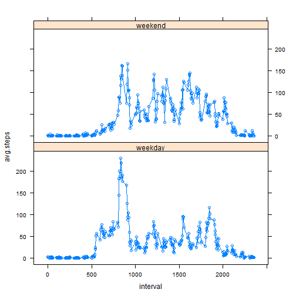

In this assignment, we explore and analyze personal movement in the context of the data set required for this assessment. Furthermore, we answer a couple of questions to contextualize our analysis and show the code herein used to produce all the plots and other related output as seen below.

## Analysis
This assignment makes use of data from a personal activity monitoring device. This device collects data at 5 minute intervals through out the day. The data consists of two months of data from an anonymous individual collected during the months of October and November, 2012 and include the number of steps taken in 5 minute intervals each day.

#### Loading and preprocessing the data
After manually unzipping the file in the working directory, this piece of code helps reading data from this file.

```r
activityData <- read.csv("./activity.csv",header = TRUE)
summary (activityData)
```

```
##      steps                date          interval     
##  Min.   :  0.00   2012-10-01:  288   Min.   :   0.0  
##  1st Qu.:  0.00   2012-10-02:  288   1st Qu.: 588.8  
##  Median :  0.00   2012-10-03:  288   Median :1177.5  
##  Mean   : 37.38   2012-10-04:  288   Mean   :1177.5  
##  3rd Qu.: 12.00   2012-10-05:  288   3rd Qu.:1766.2  
##  Max.   :806.00   2012-10-06:  288   Max.   :2355.0  
##  NA's   :2304     (Other)   :15840
```

The data looks ready for analysis. We have an idea of how it looks like, we can thus analyze it in light with the following questions organisised as subheadings below.

#### What is mean total number of steps taken per day?
In order to produce the total mean number of steps per day, we ignore the mising values in the data set. Furtheremore, we find the total number of steps taken per day and plot a histogram on this results as follows:


```r
# Loading the required package
library(dplyr)
```

```
## 
## Attaching package: 'dplyr'
## 
## The following object is masked from 'package:stats':
## 
##     filter
## 
## The following objects are masked from 'package:base':
## 
##     intersect, setdiff, setequal, union
```

```r
total.steps.per.day <- activityData %>% group_by(date) %>% summarise(total = sum(steps, na.rm = T))
```

The total mean is:


```r
total.mean <- mean(total.steps.per.day$total)
print(total.mean)
```

```
## [1] 9354.23
```

The total median is:


```r
total.median <- median(total.steps.per.day$total)
print(total.median)
```

```
## [1] 10395
```
The histogram showing a general distribution of numbers which are total number of steps for each day is obtained running this code as follows:


```r
library(ggplot2)
# Setting the default font size for my plots
theme_set(theme_gray(base_size = 14))

ggplot(total.steps.per.day, aes(x = total)) + geom_histogram(fill = "yellow", 
    colour = "black") + geom_vline(xintercept = total.mean, color = "brown", 
    linetype = "dashed", size = 1) + geom_vline(xintercept = total.median, color = "red", 
    linetype = "dashed", size = 1) + labs(title = "Histogram of total number of steps \n taken for each day") + 
    labs(x = "", y = "")
```

```
## stat_bin: binwidth defaulted to range/30. Use 'binwidth = x' to adjust this.
```

 

#### What is the average daily activity pattern?
In order to answer this question in our analysis, we look at the average number of steps taken for subsequent day 5-minute intervals, averaged across all days. This is doe through the plot below:


```r
avg.intvl.steps <- activityData %.% group_by(interval) %.% summarise(avg.intvl = mean(steps, 
    na.rm = T))
```

```
## Warning: %.% is deprecated. Please use %>%
```

```
## Warning: %.% is deprecated. Please use %>%
```

```r
# Find out which 5-minute interval contains the maximum number of steps
max.num.of.steps.interv.ind <- which(avg.intvl.steps$avg.intvl == max(avg.intvl.steps$avg.intvl))
max.num.of.steps.interv <- avg.intvl.steps[max.num.of.steps.interv.ind, 1]

qplot(interval, avg.intvl, data = avg.intvl.steps) + geom_line() + geom_vline(xintercept = max.num.of.steps.interv, 
    color = "red", linetype = "dashed", size = 1) + labs(title = "Time series of the 5-minute interval and the average number of steps taken, \n averaged across all days") + 
    labs(x = "5-minute interval signature", y = "number of steps ")
```

 

One can notice from the plot a red dashed line which is representative of the value we were looking for. This is he maximum of averaged number of steps per each 5-minute time interval. 

#### Inputing missing values

In order to deal with missing values, we first formally compute how many of these there are and then substitute them with the mean values for number of steps for the 5-minute interval as computed above that each of NA value belongs to as part of our strategy.


```r
na.rows.num <- nrow(activityData) - sum(complete.cases(activityData))
print(na.rows.num)
```

```
## [1] 2304
```

With this knowledge, We create a new dataset that is equal to the original dataset but with the missing values replaced as required.


```r
activityData2 <- activityData

for (row.num in 1:nrow(activityData2)) {

    if (is.na(activityData2[row.num, "steps"])) {

        interval.sgn <- activityData2[row.num, "interval"]
        interval.sgn.ind <- which(avg.intvl.steps[, "interval"] == interval.sgn)
        interval.steps.mean <- avg.intvl.steps[interval.sgn.ind, "avg.intvl"]
        activityData2[row.num, "steps"] <- interval.steps.mean
        
    }
}
```

Having fixed all nas, we replot as per the initial analysis conducted in terms of total mean and median values and plot accordingly.


```r
total.steps.per.day2 <- activityData2 %.% group_by(date) %.% summarise(total = sum(steps, 
    na.rm = T))
```

```
## Warning: %.% is deprecated. Please use %>%
```

```
## Warning: %.% is deprecated. Please use %>%
```
Hence, the new values for total mean and median are computed respectively as follows:

```r
total.mean.new <- mean(total.steps.per.day2$total)
print(total.mean.new)
```

```
## [1] 10766.19
```

```r
total.median.new <- median(total.steps.per.day2$total)
print(total.median.new)
```

```
## [1] 10766.19
```

The corresponding histogram shows a general distribution of numbers for total steps for each day in our data. 


```r
ggplot(total.steps.per.day2, aes(x = total)) + geom_histogram(fill = "yellow", 
    colour = "black") + geom_vline(xintercept = total.mean.new, color = "brown", 
    linetype = "dashed", size = 1) + geom_vline(xintercept = total.median.new, 
    color = "red", linetype = "dashed", size = 1) + labs(title = "Histogram of total number of steps taken for each day \n in the data set with imputed NA values") + 
    labs(x = "", y = "")
```

```
## stat_bin: binwidth defaulted to range/30. Use 'binwidth = x' to adjust this.
```

 

#### Are there differences in activity patterns between weekdays and weekends?

In order to answer such a question, we have to demarcate between weekend and weekdays. Through the chunk of code below, we create a new factor variable in the dataset with two levels "weekday" and "weekend" indicating whether a given date is a weekday or weekend day.
We then group the data accordingly to differentiate and plot the results.


```r
weekdays.sgn <- weekdays(as.Date(activityData2$date))
activityData2$day.type <- sapply(weekdays.sgn, function(sgn) {
    if (sgn %in% c("Saturday", "Sunday")) {
        return("weekend")
    } else {
        return("weekday")
    }
})

day.type.interv.steps <- activityData2 %.% group_by(interval, day.type) %.% 
    summarise(avg.steps = mean(steps))
```

```
## Warning: %.% is deprecated. Please use %>%
```

```
## Warning: %.% is deprecated. Please use %>%
```

```r
library(lattice)
xyplot(avg.steps ~ interval | day.type, data = day.type.interv.steps, type = "b", 
    layout = c(1, 2))
```

 

Looking at the plot above, one can clearly observe that the major difference in activity patterns between weekdays and weekends lies with the frequency of activities during these time frames.

We can see that over the weekends, the subject tends to be more active in the mornings during weekdays than on weekends. Also, Anther pattern is that the subject tends to sleep more over the weekends than during the week.
